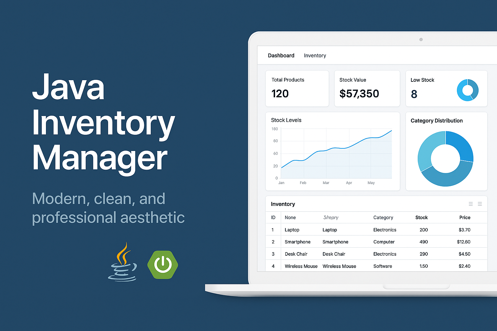

# Java-Inventory-Manager

<div align="center">


**Advanced Inventory Management Platform**

*Professional enterprise-grade Java application built with Spring Boot*

[🇺🇸 English](#english) | [🇧🇷 Português](#português)

</div>

---

## 🖼️ Imagem Hero

<div align="center">
  
</div>

---

## 🇺🇸 English

### 📋 Overview

Advanced Inventory Management Platform built with modern Java technologies and enterprise-grade architecture. This project demonstrates advanced Java development skills, Spring Boot framework expertise, and professional software engineering practices.

### ✨ Key Features

*   Real-time stock tracking
*   Automated reorder notifications
*   Barcode scanning integration
*   Multi-warehouse support
*   Advanced analytics and reporting
*   Supplier management system
*   Cost optimization algorithms
*   Mobile-responsive interface

### 🛠️ Technology Stack

*   **Java 17+** - Latest LTS version with modern language features
*   **Spring Boot 3.0+** - Enterprise application framework
*   **Spring Web** - RESTful web services
*   **Maven** - Dependency management and build automation
*   **JUnit 5** - Unit testing framework
*   **Spring Boot DevTools** - Development productivity tools

### 🚀 Quick Start

#### Prerequisites

*   Java 17 or higher
*   Maven 3.8 or higher
*   IDE (IntelliJ IDEA, Eclipse, or VS Code)

#### Installation & Setup

1.  **Clone the repository**
    ```bash
    git clone https://github.com/galafis/Java-Inventory-Manager.git
    cd Java-Inventory-Manager
    ```

2.  **Build the project**
    ```bash
    mvn clean compile
    ```

3.  **Run tests**
    ```bash
    mvn test
    ```

4.  **Start the application**
    ```bash
    mvn spring-boot:run
    ```

5.  **Access the application**

    *   Open your browser and navigate to: `http://localhost:8080`
    *   API documentation available at: `http://localhost:8080/swagger-ui.html`

### 📖 Usage Examples

#### Basic API Endpoints

```bash
# Health check
curl http://localhost:8080/actuator/health

# Main endpoint
curl http://localhost:8080/api/v1/status

# Get application info
curl http://localhost:8080/api/v1/info
```

#### Configuration

Edit `application.properties` to customize settings:

```properties
# Server configuration
server.port=8080
server.servlet.context-path=/api

# Database configuration (if applicable)
spring.datasource.url=jdbc:h2:mem:testdb
spring.datasource.driver-class-name=org.h2.Driver

# Logging configuration
logging.level.com.galafis=DEBUG
```

### 🏗️ Project Structure

```
Java-Inventory-Manager/
├── src/
│   ├── main/
│   │   ├── java/
│   │   │   └── com/galafis/
│   │   │       ├── Application.java
│   │   │       ├── controller/
│   │   │       ├── service/
│   │   │       ├── model/
│   │   │       └── config/
│   │   └── resources/
│   │       ├── application.properties
│   │       └── static/
│   └── test/
│       └── java/
├── pom.xml
├── README.md
└── LICENSE
```

### 🧪 Testing

Run the complete test suite:

```bash
# Unit tests
mvn test

# Integration tests
mvn verify

# Test coverage report
mvn jacoco:report
```

### 📦 Building for Production

```bash
# Create executable JAR
mvn clean package

# Run the JAR file
java -jar target/Java-Inventory-Manager-1.0.0.jar

# Build Docker image (if Dockerfile exists)
docker build -t Java-Inventory-Manager .
docker run -p 8080:8080 Java-Inventory-Manager
```

### 🤝 Contributing

1.  Fork the repository
2.  Create a feature branch (`git checkout -b feature/amazing-feature`)
3.  Commit your changes (`git commit -m 'Add amazing feature'`)
4.  Push to the branch (`git push origin feature/amazing-feature`)
5.  Open a Pull Request

### 📝 License

This project is licensed under the MIT License - see the [LICENSE](LICENSE) file for details.

### 👨‍💻 Author

**Gabriel Demetrios Lafis**

*   GitHub: [@galafis](https://github.com/galafis)
*   LinkedIn: [Gabriel Demetrios Lafis](https://linkedin.com/in/gabriel-lafis)

---

## 🇧🇷 Português

### 📋 Visão Geral

Plataforma Avançada de Gerenciamento de Estoque construída com tecnologias Java modernas e arquitetura de nível empresarial. Este projeto demonstra habilidades avançadas de desenvolvimento Java, expertise no framework Spring Boot e práticas profissionais de engenharia de software.

### ✨ Principais Funcionalidades

*   Rastreamento de estoque em tempo real
*   Notificações automáticas de reabastecimento
*   Integração com leitura de código de barras
*   Suporte a múltiplos armazéns
*   Análises e relatórios avançados
*   Sistema de gerenciamento de fornecedores
*   Algoritmos de otimização de custos
*   Interface responsiva para dispositivos móveis

### 🛠️ Stack Tecnológica

*   **Java 17+** - Versão LTS mais recente com recursos modernos da linguagem
*   **Spring Boot 3.0+** - Framework para aplicações empresariais
*   **Spring Web** - Serviços web RESTful
*   **Maven** - Gerenciamento de dependências e automação de build
*   **JUnit 5** - Framework de testes unitários
*   **Spring Boot DevTools** - Ferramentas de produtividade para desenvolvimento

### 🚀 Início Rápido

#### Pré-requisitos

*   Java 17 ou superior
*   Maven 3.8 ou superior
*   IDE (IntelliJ IDEA, Eclipse ou VS Code)

#### Instalação e Configuração

1.  **Clone o repositório**
    ```bash
    git clone https://github.com/galafis/Java-Inventory-Manager.git
    cd Java-Inventory-Manager
    ```

2.  **Compile o projeto**
    ```bash
    mvn clean compile
    ```

3.  **Execute os testes**
    ```bash
    mvn test
    ```

4.  **Inicie a aplicação**
    ```bash
    mvn spring-boot:run
    ```

5.  **Acesse a aplicação**

    *   Abra seu navegador e navegue para: `http://localhost:8080`
    *   Documentação da API disponível em: `http://localhost:8080/swagger-ui.html`

### 📖 Exemplos de Uso

#### Endpoints Básicos da API

```bash
# Verificação de saúde
curl http://localhost:8080/actuator/health

# Endpoint principal
curl http://localhost:8080/api/v1/status

# Obter informações da aplicação
curl http://localhost:8080/api/v1/info
```

#### Configuração

Edite `application.properties` para personalizar as configurações:

```properties
# Configuração do servidor
server.port=8080
server.servlet.context-path=/api

# Configuração do banco de dados (se aplicável)
spring.datasource.url=jdbc:h2:mem:testdb
spring.datasource.driver-class-name=org.h2.Driver

# Configuração de logging
logging.level.com.galafis=DEBUG
```

### 🏗️ Estrutura do Projeto

```
Java-Inventory-Manager/
├── src/
│   ├── main/
│   │   ├── java/
│   │   │   └── com/galafis/
│   │   │       ├── Application.java
│   │   │       ├── controller/
│   │   │       ├── service/
│   │   │       ├── model/
│   │   │       └── config/
│   │   └── resources/
│   │       ├── application.properties
│   │       └── static/
│   └── test/
│       └── java/
├── pom.xml
├── README.md
└── LICENSE
```

### 🧪 Testes

Execute a suíte completa de testes:

```bash
# Testes unitários
mvn test

# Testes de integração
mvn verify

# Relatório de cobertura de testes
mvn jacoco:report
```

### 📦 Build para Produção

```bash
# Criar JAR executável
mvn clean package

# Executar o arquivo JAR
java -jar target/Java-Inventory-Manager-1.0.0.jar

# Build da imagem Docker (se Dockerfile existir)
docker build -t Java-Inventory-Manager .
docker run -p 8080:8080 Java-Inventory-Manager
```

### 🤝 Contribuindo

1.  Faça um fork do repositório
2.  Crie uma branch para sua feature (`git checkout -b feature/funcionalidade-incrivel`)
3.  Commit suas mudanças (`git commit -m 'Adiciona funcionalidade incrível'`)
4.  Push para a branch (`git push origin feature/funcionalidade-incrivel`)
5.  Abra um Pull Request

### 📝 Licença

Este projeto está licenciado sob a Licença MIT - veja o arquivo [LICENSE](LICENSE) para detalhes.

### 👨‍💻 Autor

**Gabriel Demetrios Lafis**

*   GitHub: [@galafis](https://github.com/galafis)
*   LinkedIn: [Gabriel Demetrios Lafis](https://linkedin.com/in/gabriel-lafis)

---

<div align="center">

**⭐ Se este projeto foi útil para você, considere dar uma estrela!**

**🚀 Desenvolvido com ❤️ por Gabriel Demetrios Lafis**

</div>

